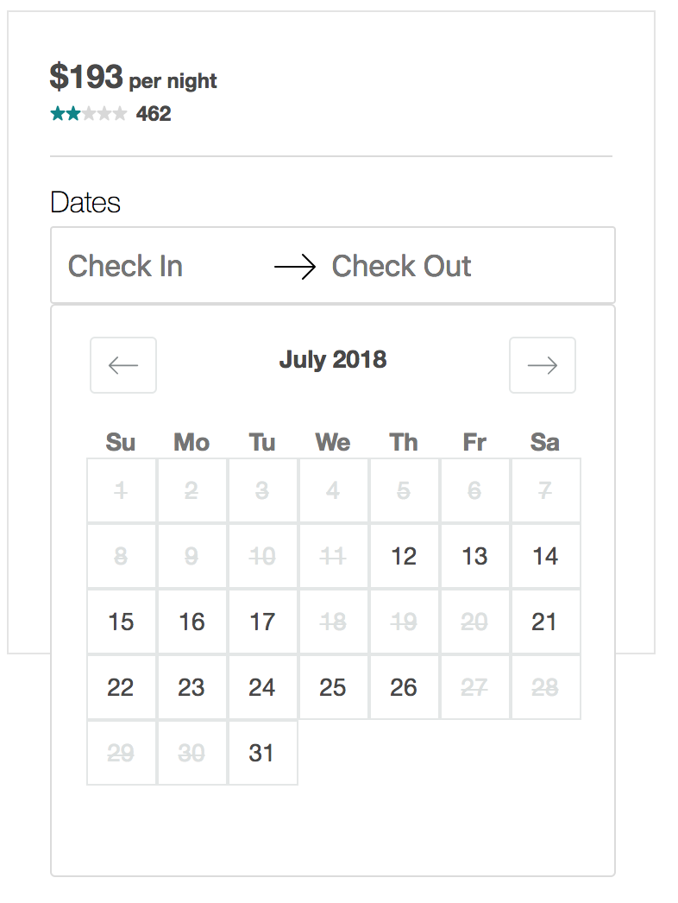
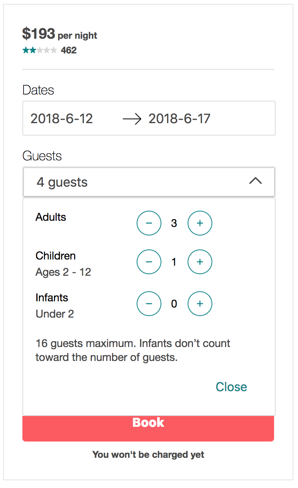
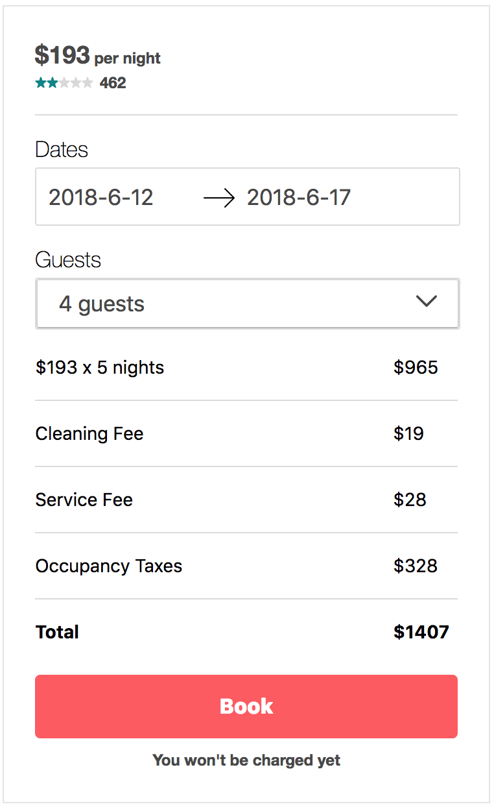

# Project Nomad: Booking Module

A recreation of AirBnb's booking module, made with React, Express, MySQL & Styled Components.



## Related Projects

  - https://github.com/project-nomad/review-module
  - https://github.com/project-nomad/listing-description-module
  - https://github.com/project-nomad/image-carousel-module

### Installing Dependencies & Getting Started

From within the root directory:

```sh
npm install -g webpack
npm install
npm run react-dev
mysql.server start
mysql -u root < sample-data/schema.sql
node sample-data/generator.js
npm run start-server
```

Navigate to http://localhost:3001/listings/1/ in your browser.  The data generator file will create data for listings 1 - 100.
